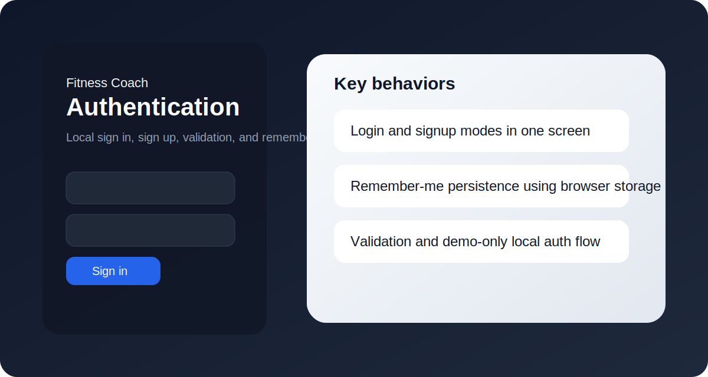
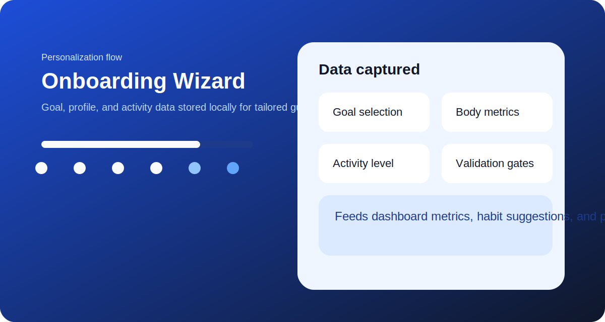
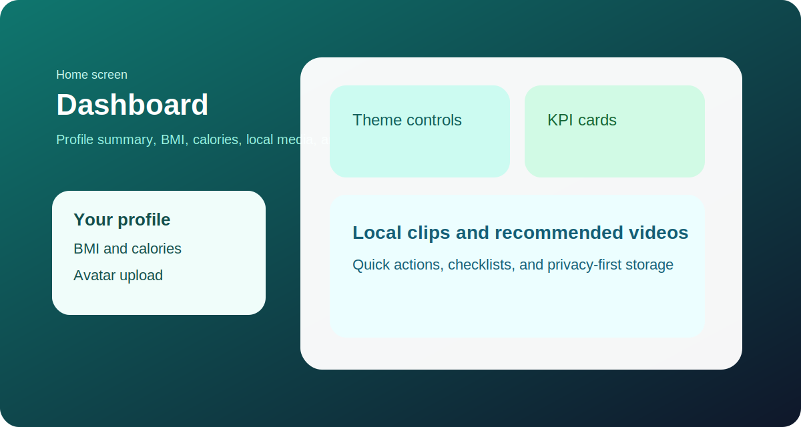
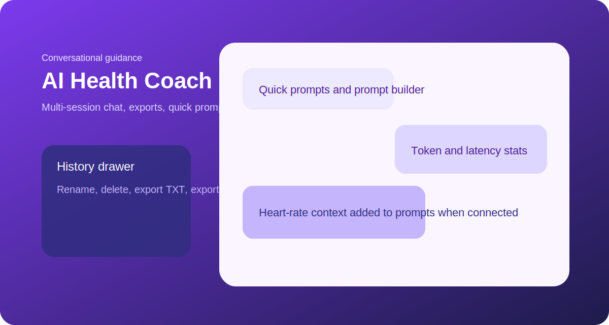
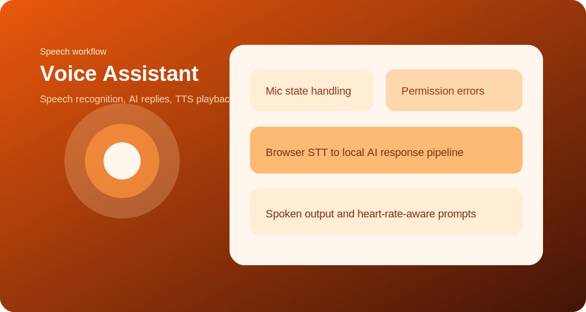
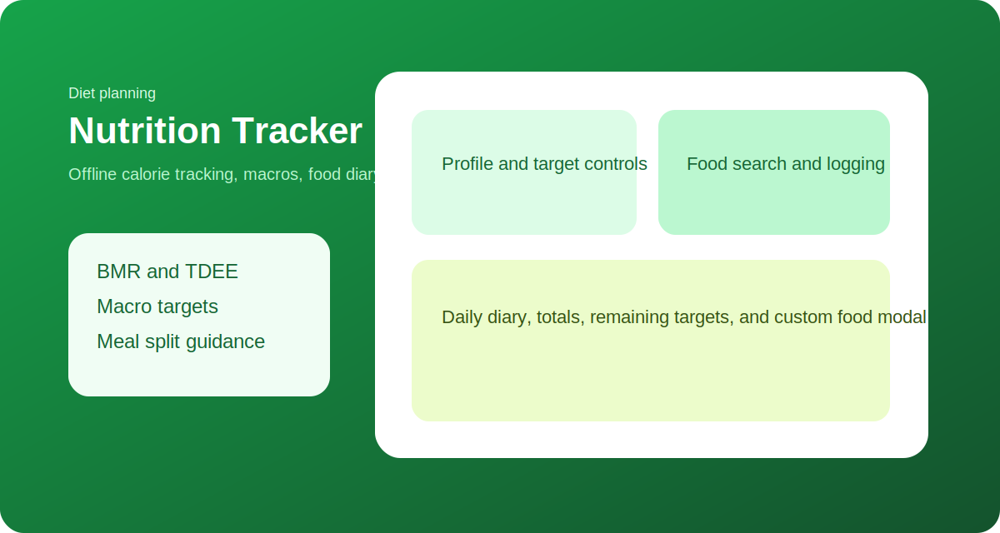
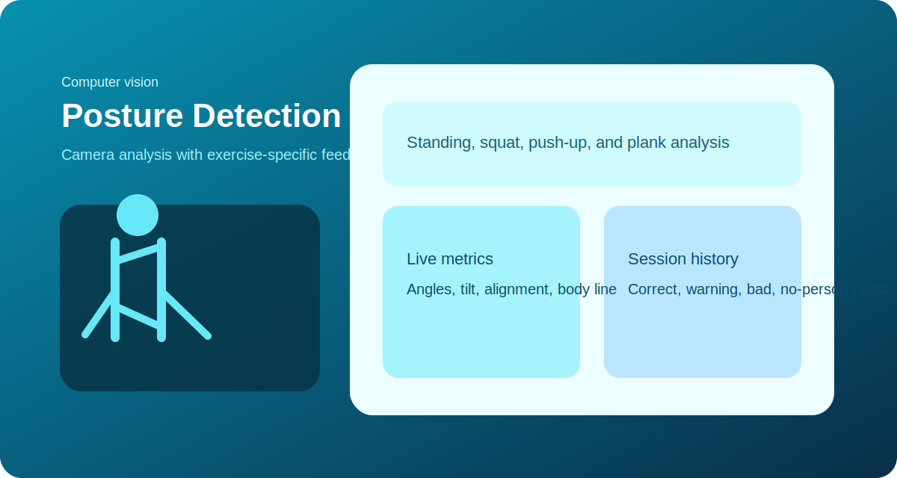
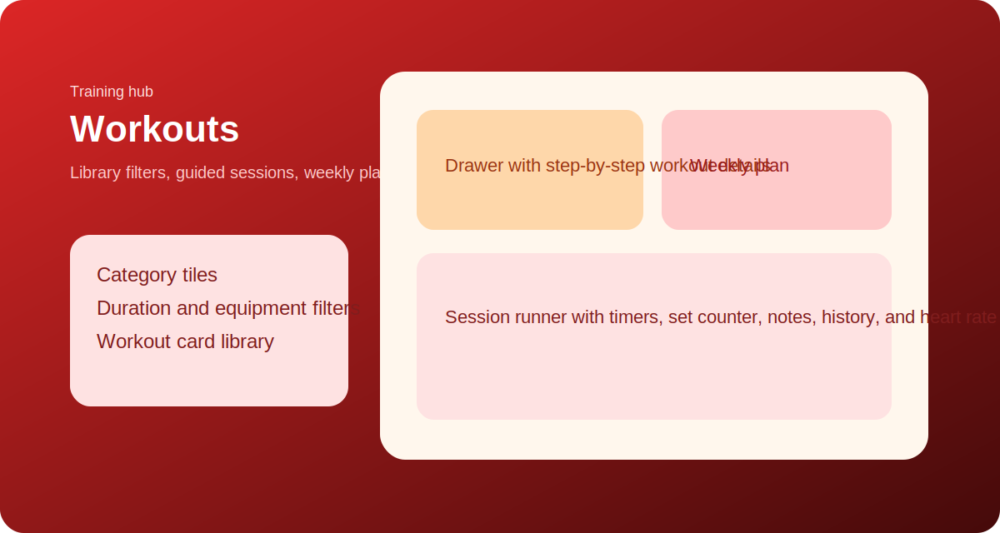
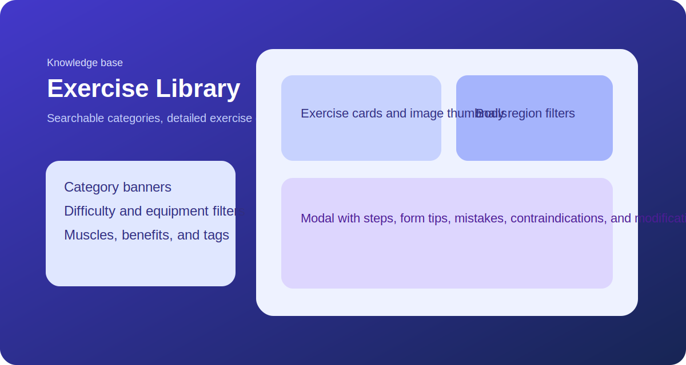
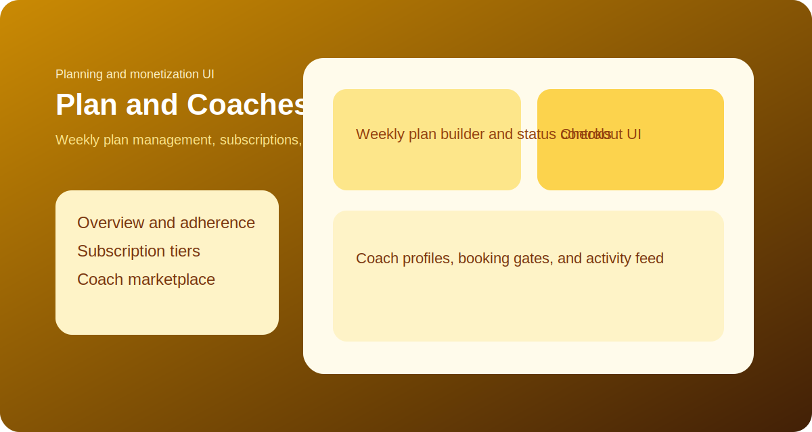

# Fitness Coach Web App

A privacy-first fitness web application built with React, TypeScript, RunAnywhere, MediaPipe, Web Bluetooth, and a small local Express API.

This repository is no longer just the original RunAnywhere starter. It has been extended into a multi-page fitness product with onboarding, AI coaching, voice interactions, nutrition tracking, posture analysis, workout planning, a large exercise library, subscription and coach marketplace flows, and Bluetooth heart-rate support.

## Overview

Fitness Coach combines three execution styles in one app:

- On-device runtime initialization through RunAnywhere for local AI and browser acceleration.
- Browser-native health features such as Web Bluetooth, Web Speech, MediaPipe pose detection, localStorage persistence, and media playback.
- A local API server for text generation used by the current Coach and Voice experiences.

## Main Product Areas

| Area | What it does | Runtime |
| --- | --- | --- |
| Authentication | Mock login and signup with remember-me persistence | Browser only |
| Onboarding | Collects goals and profile data for personalization | Browser only |
| Dashboard | Shows profile summary, BMI, calories, local videos, and suggested next steps | Browser only |
| Coach | Chat-based health and fitness assistant with chat history and export | Local API + browser |
| Voice | Speech-to-text, AI response generation, and text-to-speech | Browser APIs + local API |
| Nutrition | Offline calorie tracker, macro planning, custom foods, and food diary | Browser only |
| Posture | Real-time pose tracking, exercise-specific posture scoring, and posture history | Browser only |
| Workouts | Guided workout library, weekly plan generation, session runner, and history | Browser only |
| Exercise Library | Searchable exercise database with categories, steps, tips, and visuals | Browser only |
| Plan | Weekly plan manager, subscription UI, checkout UI, and coach marketplace | Browser only |
| Heart Rate | Connects Bluetooth heart-rate devices and feeds heart rate into parts of the app | Browser only |

## Screen Guide

### 1. Authentication



- Login and signup modes in a single screen
- Email and password validation with local persistence
- Remember-me support through `localStorage` or `sessionStorage`
- Demo authentication flow without a backend auth service

### 2. Onboarding



- Multi-step profile capture for goal, gender, age, height, weight, and activity
- Progress tracking with validation before moving forward
- Stores onboarding data locally for later personalization
- Drives downstream dashboard recommendations and planning logic

### 3. Dashboard



- Personalized greeting, theme selection, and profile summary
- BMI and estimated calorie calculations from onboarding data
- Local avatar upload stored on-device
- Local focus clips plus curated workout video recommendations
- Quick checklist and privacy-first daily guidance

### 4. Coach



- Multi-session chat history stored locally
- Quick prompts for workouts, meals, sleep, and habits
- Export chat sessions as TXT or JSON
- Token, speed, and latency stats per assistant reply
- Live heart-rate context injected into prompts when a Bluetooth monitor is connected

### 5. Voice



- Browser speech recognition for fast microphone capture
- Audio-level orb driven by Web Audio analysis
- AI-generated fitness responses spoken back with browser TTS
- Error handling for browser support, microphone permissions, and recognition issues
- Live heart-rate context included in voice prompts

### 6. Nutrition



- BMR, TDEE, calorie target, and macro calculations
- Offline food database with Indian and common staple foods
- Custom food creation and persistent food diary
- Daily totals, remaining targets, and meal split guidance
- Entire nutrition workflow works without a backend service

### 7. Posture



- Real-time posture tracking with MediaPipe Pose
- Modes for standing, squat, push-up, and plank
- Live metrics such as tilt, body line, torso angle, and knee angle
- Session history with frame-quality percentages and averaged metrics
- Fully browser-based camera processing

### 8. Workouts



- Workout discovery by category, difficulty, equipment, and duration
- Weekly plan generation from a built-in workout catalog
- Guided session runner with timers, sets, reps, and notes
- Workout completion history stored locally
- Active workout screen surfaces connected heart-rate data

### 9. Exercise Library



- Large categorized library spanning neck, shoulders, arms, core, legs, yoga, cardio, stretching, and more
- Search by exercise name, muscle group, benefits, and tags
- Detailed modal for steps, form tips, common mistakes, contraindications, and modifications
- Uses repo-hosted exercise thumbnails and step images from `public/images/exercises`

### 10. Plan and Coach Marketplace



- Weekly plan overview with adherence tracking and activity feed
- Subscription tier UI for Basic, Pro, and Elite plans
- Mock checkout flow with payment method selection
- Coach marketplace with search, filtering, profile drawer, and booking flow
- Coach hiring is intentionally gated behind the Elite tier in the UI

## Feature Coverage

### Cross-cutting features

- Sidebar navigation with responsive app shell
- Acceleration badge showing RunAnywhere execution mode
- Logout and local session clearing
- Bluetooth heart-rate connect and disconnect controls in the global top bar
- Persistent local state across chat, workouts, nutrition, posture, plan, onboarding, auth, avatar, and dashboard theme

### Heart-rate integration

The Bluetooth provider connects to the standard Heart Rate service over Web Bluetooth and currently feeds:

- The global top-bar connection badge
- Coach prompts
- Voice prompts
- Active workout session display

### Additional modules in the codebase

The repository also contains modules that are not currently mounted in the main sidebar shell:

- `src/components/VisionTab.tsx`: on-device camera + VLM workflow using RunAnywhere multimodal models
- `src/components/ToolsTab.tsx`: tool-calling playground for registered demo tools and custom tool definitions

## Architecture

### Frontend runtime

- React 19 + TypeScript + Vite
- RunAnywhere SDK initialization in `src/runanywhere.ts`
- MediaPipe Pose in `src/components/PostureTab.tsx`
- Browser SpeechRecognition, speechSynthesis, and Web Audio in `src/components/VoiceTab.tsx`
- Web Bluetooth in `src/context/BluetoothContext.tsx`
- Local persistence through `localStorage` and `sessionStorage`

### AI path in the current app

The app uses a hybrid setup:

- RunAnywhere is initialized on startup and provides the on-device model/runtime foundation.
- The current Coach and Voice tabs do not generate text directly with an on-device model.
- Instead, they call `src/server/index.js`, which proxies prompts to the Groq Chat Completions API.

This means:

- Dashboard, Nutrition, Posture, Workouts, Exercise Library, Plan, Auth, and Onboarding are browser-local experiences.
- Coach and Voice currently require the local API server and a valid `GROQ_API_KEY`.
- RunAnywhere model status is still surfaced in the UI for readiness and future local or hybrid expansion.

### Server

`src/server/index.js` exposes:

- `POST /api/ai/chat`

The server:

- Accepts a plain prompt from the frontend
- Calls Groq with the `llama-3.1-8b-instant` model
- Returns generated text and token usage
- Allows CORS for the local Vite frontend

### Storage model

The application stores data locally under several keys, including:

- `fitnesscoach:auth:v1`
- `fitnesscoach:onboarding:v1`
- `fitnesscoach:chat:sessions:v2`
- `fitnesscoach:nutrition:v2`
- `fitnesscoach:posture:history:v1`
- `fitnesscoach:workouts:v4`
- `fitnesscoach:plan:v3`
- `fitnesscoach:dashTheme:v2`
- `fitnesscoach:avatar:v2`

## Project Structure

```text
src/
  App.tsx
  main.tsx
  runanywhere.ts
  context/
    BluetoothContext.tsx
  components/
    ChatTab.tsx
    DashboardTab.tsx
    ExerciseLibraryTab.tsx
    LoginPage.tsx
    NutritionTab.tsx
    OnboardingWizard.tsx
    PlanTab.tsx
    PostureTab.tsx
    ToolsTab.tsx
    VisionTab.tsx
    VoiceTab.tsx
    WorkoutTab.tsx
  server/
    AiService.ts
    index.js
  workers/
    vlm-worker.ts
public/
  images/
    exercises/
src/assets/
src/coaches/
docs/
  readme/
```

## Local Development

### Prerequisites

- Node.js 18 or newer
- npm
- Chrome or Edge for Web Bluetooth and the best browser API support
- Camera permission for posture features
- Microphone permission for voice features
- A Groq API key for chat and voice generation

### Environment

Create or update `.env` in the project root:

```env
GROQ_API_KEY=your_groq_api_key_here
PORT=8787
```

### Install

```bash
npm install
```

### Run the app

```bash
npm run dev
```

This starts:

- Vite on `http://localhost:5173`
- The local API server on `http://localhost:8787`

### Other scripts

```bash
npm run server
npm run build
```

## Browser and Platform Notes

- Web Bluetooth requires a secure context and compatible browsers, typically Chrome or Edge.
- Speech recognition support varies by browser and is most reliable in Chromium-based browsers.
- Posture detection needs camera permission and adequate lighting.
- The AI service URL in `src/server/AiService.ts` is hardcoded to `http://localhost:8787/api/ai/chat` for local development.

## Deployment Notes

The repository includes `vercel.json` and a Vite configuration prepared for cross-origin isolation headers.

Important deployment considerations:

- The current frontend expects the AI endpoint at `http://localhost:8787`, so production deployment needs either:
  - a matching hosted API and updated frontend endpoint, or
  - a reverse proxy strategy
- Bluetooth, microphone, and camera capabilities depend on browser security context and host configuration
- The mock authentication and mock payments are UI-only and should be replaced before production use

## Current Demo vs Production Boundaries

These parts are implemented as frontend product flows but are still mock or demo behavior:

- Login and signup use local browser storage, not a real auth backend
- Subscription checkout is UI-only and does not process payments
- Coach booking is UI-only and does not create real coach relationships
- Chat and voice depend on a local development API rather than a deployed production service

## Tech Stack

- React 19
- TypeScript
- Vite 6
- Express 5
- RunAnywhere Web SDK
- MediaPipe Tasks Vision
- Web Bluetooth API
- Web Speech API
- Web Audio API

## Repository Goal

This codebase is best understood as a fitness product prototype built on top of a RunAnywhere web starter foundation. It demonstrates how local-first browser features, hybrid AI workflows, and rich UI state can be composed into a single consumer health and fitness experience.
